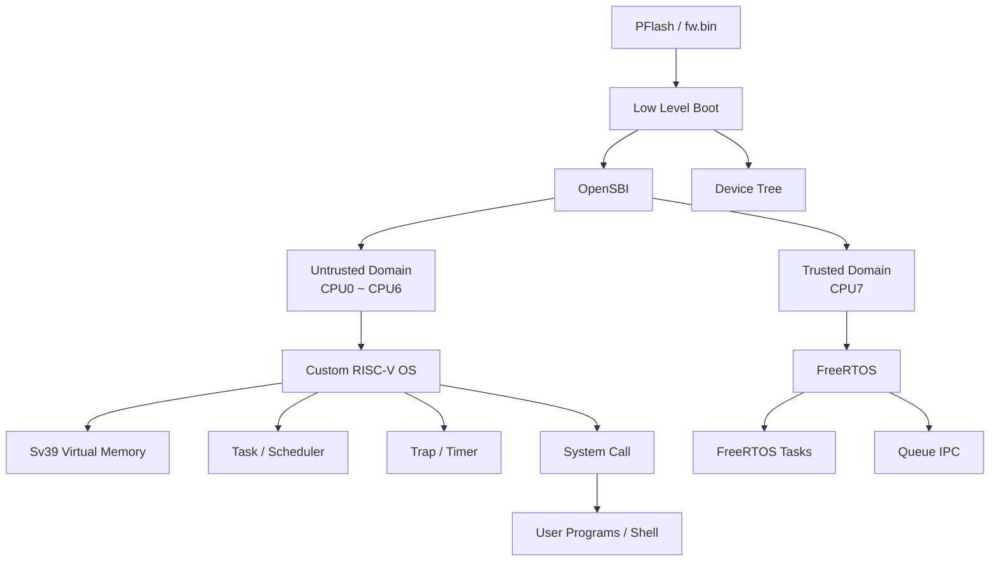

# Quard-Star

> A RISC-V 64-bit operating system learning project based on **QEMU + OpenSBI + a custom OS kernel + FreeRTOS**.

Quard-Star 是一个面向操作系统、RISC-V 架构与底层软件学习的实验项目。项目基于 QEMU 8.0.2 构建自定义 `quard-star` 虚拟机平台，并搭建了从 **PFlash 启动、低级 Boot、OpenSBI、操作系统内核到用户态程序** 的完整运行链路。

在普通运行域中，项目实现了一个轻量级 RISC-V64 教学操作系统，包括页表与虚拟内存、任务切换、Trap、系统调用、ELF 用户程序加载以及用户 Shell；同时利用 **OpenSBI Domain** 划分可信域与非可信域，在独立 Hart 上运行 FreeRTOS，用于学习多运行域隔离与异构软件系统的基本实现方式。

---

## Features

### RISC-V / QEMU Platform

- 基于 **QEMU 8.0.2** 的 RISC-V64 `quard-star` 虚拟板
- 8 个 RISC-V Hart
- 1 GiB RAM
- PFlash 启动
- NS16550A UART
- PLIC 外部中断控制器
- CLINT 核间/定时器中断控制器
- Goldfish RTC
- Device Tree 硬件描述

### Boot & OpenSBI

- 自定义低级启动代码 `boot/start.s`
- 从 PFlash 搬运各级固件到 DRAM
- 移植并构建 OpenSBI `quard_star` Platform
- 使用 Device Tree 向 OpenSBI 描述 CPU、内存及外设
- 使用 **OpenSBI Domain** 划分可信域和非可信域

### Custom OS Kernel

- RISC-V Supervisor Mode 内核运行环境
- Sv39 三层页表
- 4 KiB 页粒度物理内存管理
- 内核页表与用户页表
- Trampoline / Trap Context 映射
- 用户态与内核态切换
- ELF64 用户程序解析与加载
- 用户栈创建
- Task Control Block
- 上下文切换
- Timer Trap 驱动的任务调度
- `fork` 式进程复制
- `exec` 用户程序替换

### System Calls

当前实现的主要系统调用包括：

| System Call    | Description            |
| -------------- | ---------------------- |
| `write`        | 用户态输出             |
| `read`         | 用户态字符输入         |
| `sched_yield`  | 主动让出 CPU           |
| `clone / fork` | 创建子进程             |
| `exec`         | 加载并执行新的用户程序 |

### User Space

项目包含简单的用户态运行环境以及示例程序：

- `shell`：简单交互式 Shell
- `write`：输出测试程序
- `time`：时间/调度相关测试程序
- `xec`：`exec` 相关测试程序

用户 Shell 读取串口输入，并通过 `sys_exec()` 按程序名加载已嵌入固件的 ELF 用户程序。

### Trusted Domain / FreeRTOS

可信域运行 FreeRTOS，并提供：

- FreeRTOS Kernel
- 多任务创建
- FreeRTOS Scheduler
- Queue 消息队列
- 独立 UART/MMIO 资源
- OpenSBI Domain CPU 与内存访问控制

当前 Device Tree 中：

- `CPU0 ~ CPU6` 属于非可信域
- `CPU7` 属于可信域
- 非可信域入口为自研 OS
- 可信域入口为 FreeRTOS

---

## Architecture



---

## Boot Flow

整体启动流程如下：

```text
QEMU
 │
 │  PFlash
 ▼
Low Level Boot
 │
 ├── Load OpenSBI
 ├── Load Device Tree
 ├── Load Trusted Firmware
 └── Load Custom OS
 │
 ▼
OpenSBI (M-Mode)
 │
 ├── Untrusted Domain ──> Custom OS (S-Mode)
 │
 └── Trusted Domain   ──> FreeRTOS
```

固件由 `build.sh` 合成为一个 `fw.bin`：

| PFlash Offset | Image                              |
| ------------: | ---------------------------------- |
|    `0x000000` | Low Level Boot                     |
|    `0x080000` | OpenSBI Device Tree                |
|    `0x200000` | OpenSBI Firmware                   |
|    `0x400000` | Trusted Domain / FreeRTOS Firmware |
|    `0x800000` | Custom OS                          |

低级 Boot 再将各固件搬运到对应 DRAM 地址，其中主要入口包括：

```text
OpenSBI        -> 0x80000000
Custom OS      -> 0x80200000
Device Tree    -> 0x82200000
Trusted Domain -> 0xBF800000
```

---

## OS Architecture

自研 OS 的主要执行路径：

```text
User Application
       │
       │ ecall
       ▼
   Trampoline
       │
       ▼
  Trap Handler
       │
       ├── System Call
       │     ├── read
       │     ├── write
       │     ├── yield
       │     ├── fork
       │     └── exec
       │
       └── Timer Interrupt
               │
               ▼
            Scheduler
               │
               ▼
          Context Switch
```

用户程序以 ELF64 格式编译，在构建阶段嵌入 OS 镜像。内核解析 ELF Program Header，为 `PT_LOAD` 段申请物理页并建立用户页表映射，然后创建用户栈并跳转到 ELF Entry Point。

---

## Memory Management

自研 OS 使用 **Sv39** 虚拟内存机制。

目前主要实现包括：

```text
Virtual Address
      │
      ▼
     VPN
      │
      ├── VPN[2]
      ├── VPN[1]
      └── VPN[0]
      │
      ▼
3-Level Page Table
      │
      ▼
     PTE
      │
      ▼
Physical Page Number
```

内存管理模块支持：

- 物理页申请与释放
- 页表创建
- Page Table Walk
- 页映射 / 解除映射
- Kernel Page Table
- User Page Table
- 用户地址到物理地址转换
- 用户空间复制
- Trampoline 映射
- Trap Context 映射

---

## Project Structure

```text
Quard-Star/
├── boot/                       # Low level boot
│   ├── start.s
│   └── boot.lds
│
├── dts/                        # Device Tree
│   ├── quard_star_sbi.dts
│   └── quard_star_uboot.dts
│
├── opensbi/                    # OpenSBI source and custom platform
│
├── os/                         # Custom RISC-V OS
│   ├── include/
│   ├── lib/
│   │   ├── load.c              # ELF loader
│   │   ├── syscall.c           # User syscall wrapper
│   │   ├── sbi.c
│   │   └── ...
│   ├── src/
│   │   ├── entry.S
│   │   ├── memory.c            # Page table / memory
│   │   ├── task.c              # Process / scheduler
│   │   ├── trap.c              # Trap / syscall handling
│   │   ├── timer.c
│   │   ├── switch.S
│   │   └── ...
│   └── user/
│       ├── user_shell.c
│       ├── write.c
│       ├── time.c
│       └── xec.c
│
├── trusted_domain/             # FreeRTOS trusted domain
│   ├── FreeRTOS-Kernel/
│   ├── FreeRTOSConfig.h
│   ├── main.c
│   └── ...
│
├── qemu-8.0.2/                 # QEMU source
│
├── build.sh                    # Build all components and generate fw.bin
├── run.sh                      # Run QEMU
└── gdb_run.sh                  # Start QEMU in GDB debug mode
```

---

## Environment

推荐在 Linux / Ubuntu 环境下构建。

主要依赖：

- GCC / GNU Make
- `riscv64-unknown-elf-*` RISC-V bare-metal toolchain
- Device Tree Compiler (`dtc`)
- QEMU build dependencies
- Python 3
- Ninja
- GLib / Pixman / GTK development packages

Ubuntu / Debian 可以先安装常用依赖：

```bash
sudo apt update

sudo apt install \
    build-essential \
    gcc-riscv64-unknown-elf \
    binutils-riscv64-unknown-elf \
    device-tree-compiler \
    pkg-config \
    libglib2.0-dev \
    libpixman-1-dev \
    libgtk-3-dev \
    ninja-build \
    python3
```

不同 Ubuntu 版本中的 QEMU 构建依赖可能略有差异，如果 `qemu-8.0.2/configure` 提示缺少依赖，请根据提示补充对应开发包。

---

## Build

Clone repository:

```bash
git clone https://github.com/zhangzhen3121-png/Quard-Star.git
cd Quard-Star
```

添加执行权限：

```bash
chmod +x build.sh run.sh gdb_run.sh
```

构建完整系统：

```bash
./build.sh
```

`build.sh` 会依次完成：

```text
QEMU
 ↓
Low Level Boot
 ↓
Trusted Domain / FreeRTOS
 ↓
OpenSBI
 ↓
Device Tree
 ↓
Custom OS
 ↓
fw.bin
```

最终固件位于：

```text
output/fw/fw.bin
```

---

## Run

构建成功后执行：

```bash
./run.sh
```

运行脚本使用的主要 QEMU 参数为：

```text
Machine : quard-star
Memory  : 1 GiB
CPU     : 8 Harts
Boot    : PFlash
Console : UART / stdio
```

QEMU 会从生成的 `output/fw/fw.bin` 启动整个系统。

---

## GDB Debug

项目提供 `gdb_run.sh`：

```bash
./gdb_run.sh
```

该脚本通过 QEMU：

```text
-s -S
```

启动 GDB Server，并在 CPU 执行第一条指令前暂停。

之后可以在另一个终端使用：

```bash
riscv64-unknown-elf-gdb os/os.elf
```

进入 GDB 后：

```gdb
target remote :1234
```

即可进行断点、单步、寄存器和内存调试。

---

## What Can Be Learned

这个项目主要用于理解从硬件模型到用户程序之间各层软件如何协同工作：

```text
QEMU Virtual Hardware
        ↓
Device Tree
        ↓
Low Level Boot
        ↓
OpenSBI / M-Mode
        ↓
Supervisor Mode Kernel
        ↓
Virtual Memory
        ↓
Trap / Interrupt
        ↓
Process / Scheduler
        ↓
System Call
        ↓
User Application
```

通过项目可以实践：

- RISC-V 特权级与 CSR
- M / S / U Mode 切换
- SBI 调用机制
- RISC-V Trap 与中断
- Sv39 页表
- ELF 文件格式
- 内核与用户态地址空间
- 上下文切换
- 进程创建
- 系统调用
- QEMU 设备模型
- Device Tree
- OpenSBI Platform
- OpenSBI Domain
- FreeRTOS 移植与任务调度

---

## Current Status

这是一个以 **操作系统原理和 RISC-V 底层机制学习** 为目标的实验项目，目前重点在于建立完整的软件栈并验证关键机制，而不是作为生产级操作系统使用。

后续可以继续完善：

- [ ] 完善进程生命周期与 `exit / wait`
- [ ] 完善异常处理与 Page Fault
- [ ] 增加 Copy-on-Write Fork
- [ ] 增加用户态 Heap
- [ ] 实现简单文件系统
- [ ] 增加 VirtIO Block / Network 驱动
- [ ] 完善多核调度
- [ ] 增加可信域与非可信域通信机制
- [ ] 补充自动化测试

---

## Acknowledgements

本项目用于学习与研究，仓库中包含或基于以下开源项目进行实验和适配：

- [QEMU](https://www.qemu.org/)
- [OpenSBI](https://github.com/riscv-software-src/opensbi)
- [FreeRTOS Kernel](https://github.com/FreeRTOS/FreeRTOS-Kernel)

相关第三方代码请遵循各自项目的开源许可证。

---

## Author

**Zhen Zhang**

GitHub: [@zhangzhen3121-png](https://github.com/zhangzhen3121-png)

---

If this project is helpful for learning RISC-V and operating systems, feel free to star the repository.
